<table border="0" cellpadding="0" cellspacing="0">
  <tr>
    <td valign="top" width="50%">
      
       
      
    </td>
    <td valign="top" width="50%">
      
    </td>
  </tr>
</table>

💼 **Rajz d.o.o. Sarajevo**  
🧠 **.NET Developer | PostgreSQL Developer | ERP System Architect**

---

### 🚀 Current Focus
I'm the creator and lead developer of R-Exus, a modular business management system designed to unify and automate company operations — from production and planning to finance, sales, and analytics.

R-Exus is built to support organizations of all sizes — from small retail shops to complex enterprises that include manufacturing, distribution, construction, trading networks, fuel stations, hotels, and more.

The system focuses on performance, scalability, and data integrity, combining .NET and PostgreSQL technologies to deliver a fast, secure, and reliable platform for everyday business operations.

---
### 💡 Interests
- Database architecture & query optimization  
- ERP system design
- API security, encryption, and performance benchmarking  
- Automation in business planning & production analytics
  
---
**🧠 Languages**

**🧩 Frameworks & Libraries**

**🗄️ Databases & Hosting**

**⚙️ Tools**

---

### 🌍 Connect With Me

